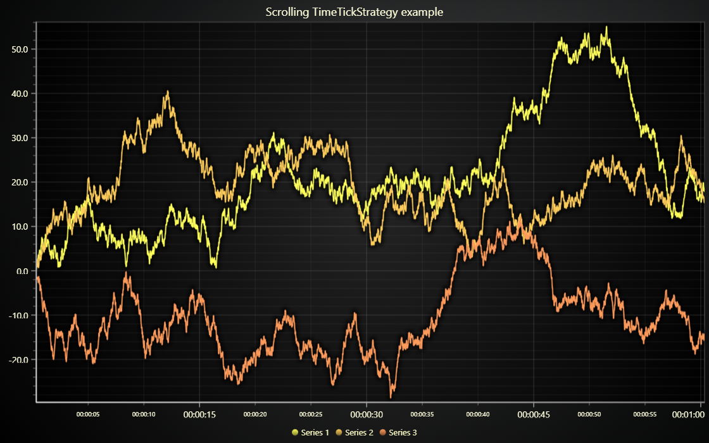

# JavaScript Scrolling Time Ticks Chart

This demo application belongs to the set of examples for LightningChart JS, data visualization library for JavaScript.

LightningChart JS is entirely GPU accelerated and performance optimized charting library for presenting massive amounts of data. It offers an easy way of creating sophisticated and interactive charts and adding them to your website or web application.

The demo can be used as an example or a seed project. Local execution requires the following steps:

-   Make sure that relevant version of [Node.js](https://nodejs.org/en/download/) is installed
-   Open the project folder in a terminal:

          npm install              # fetches dependencies
          npm start                # builds an application and starts the development server

-   The application is available at _http://localhost:8080_ in your browser, webpack-dev-server provides hot reload functionality.

## Description

Example that showcases the `TimeTickStrategy` feature with real-time data.

`TimeTickStrategy` is one of the available options for _automatic axis tick placement and formatting_. It is designed for depicting milliseconds timestamp data with extremely high resolution and flexibility.

The effective range of `TimeTickStrategy` starts from maximum of 100 hours all the way down to **individual milliseconds level**.

For this entire range, the tick labels are formatted dynamically showing the currently relevant precision with all the required accuracy.

`TimeTickStrategy` is a very powerful feature for real-time data monitoring applications, since its effective range perfectly covers minute, hour and even day intervals - not to mention that you can zoom in so deep that you can even see differences between individual microseconds.

Since `TimeTickStrategy` interprets axis coordinates as "milliseconds after 0", it doesn't make much sense to supply data directly as UNIX timestamps - instead, most applications would choose some "time origin" and subtract it from the UNIX timestamp. This means that the data will be displayed as "difference from time origin".

In this example, `timeOrigin` is set to `Date.now()` at the start, and data point X values are calculated live as `x: Date.now() - timeOrigin`.

## What is the difference between Time ticks and DateTime ticks?

The effective Axis range; `TimeTickStrategy` is used for depicting high-resolution data within some days max., while `DateTimeStrategy` is used for depicting lower resolution data over the span of long times, like some months or even tens of years.

## API Links

* [LightningChart]
* [Automatic axis scrolling options]
* [Automatic tick placement options]
* [Color factory RGBA]
* [Solid fill style]
* [Chart XY]
* [Axis XY]
* [Line Series XY]
* [Legend Box]

## Support

If you notice an error in the example code, please open an issue on [GitHub][0] repository of the entire example.

Official [API documentation][1] can be found on [LightningChart][2] website.

If the docs and other materials do not solve your problem as well as implementation help is needed, ask on [StackOverflow][3] (tagged lightningchart).

If you think you found a bug in the LightningChart JavaScript library, please contact sales@lightningchart.com.

Direct developer email support can be purchased through a [Support Plan][4] or by contacting sales@lightningchart.com.

[0]: https://github.com/Arction/
[1]: https://lightningchart.com/lightningchart-js-api-documentation/
[2]: https://lightningchart.com
[3]: https://stackoverflow.com/questions/tagged/lightningchart
[4]: https://lightningchart.com/support-services/

© LightningChart Ltd 2009-2022. All rights reserved.

[LightningChart]: https://lightningchart.com/js-charts/api-documentation/v5.1.0/functions/lightningChart-1.html
[Automatic axis scrolling options]: https://lightningchart.com/js-charts/api-documentation/v5.1.0/variables/AxisScrollStrategies.html
[Automatic tick placement options]: https://lightningchart.com/js-charts/api-documentation/v5.1.0/variables/AxisTickStrategies.html
[Color factory RGBA]: https://lightningchart.com/js-charts/api-documentation/v5.1.0/functions/ColorRGBA.html
[Solid fill style]: https://lightningchart.com/js-charts/api-documentation/v5.1.0/classes/SolidFill.html
[Chart XY]: https://lightningchart.com/js-charts/api-documentation/v5.1.0/classes/ChartXY.html
[Axis XY]: https://lightningchart.com/js-charts/api-documentation/v5.1.0/classes/Axis.html
[Line Series XY]: https://lightningchart.com/js-charts/api-documentation/v5.1.0/classes/LineSeries.html
[Legend Box]: https://lightningchart.com/js-charts/api-documentation/v5.1.0/classes/Chart.html#addLegendBox

